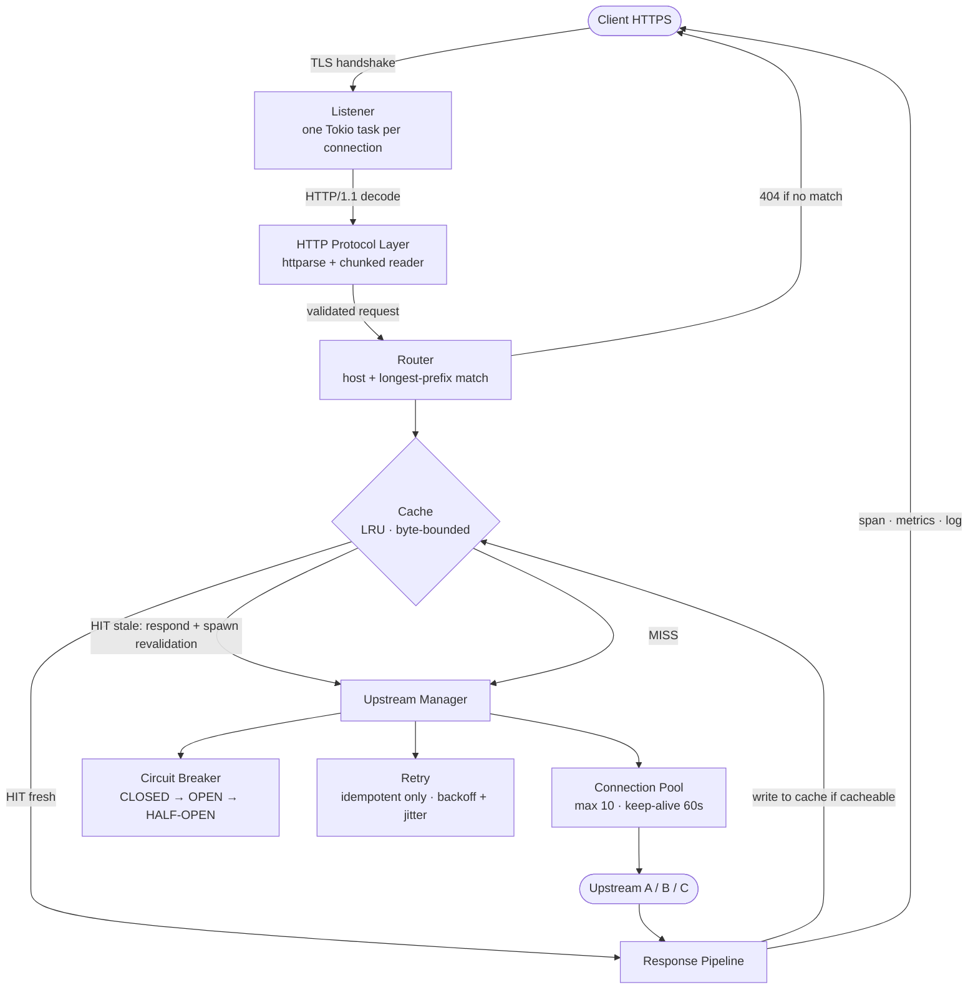
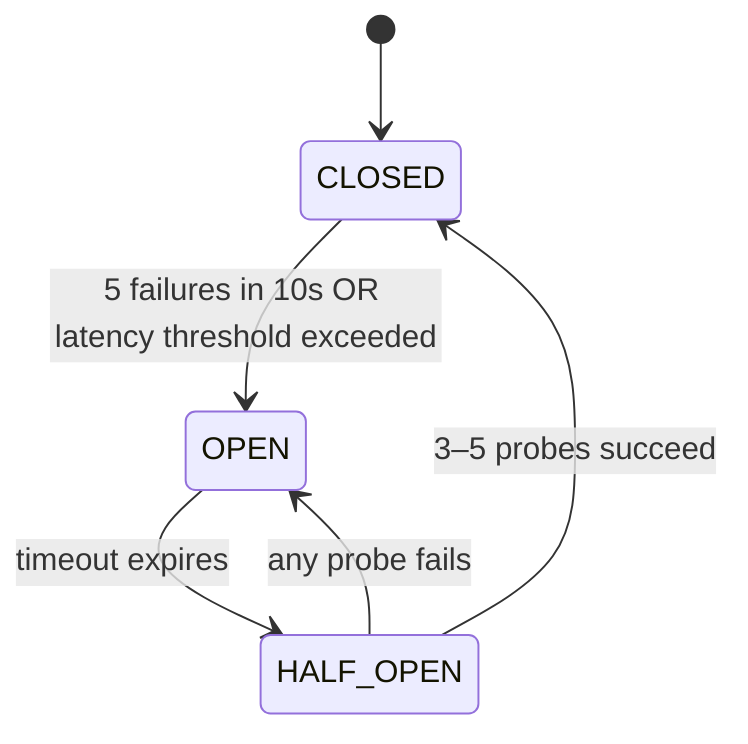
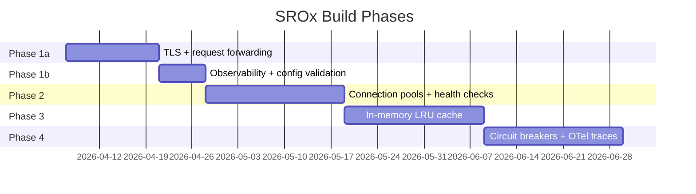

# SROx

A production-aware reverse proxy built for Speed, Reliability, and Observability — from first principles, in Rust.

| Author        | Date           | Status |
| ------------- | -------------- | ------ |
| James Muriuki | 4th April 2026 | Draft  |

---

| S | R | O |
| --- | --- | --- |
| **Speed** | **Reliability** | **Observability** |
| Sub-millisecond cache hits. Connection reuse. Zero-copy where possible. | Circuit breakers. Retries. Graceful upstream failure. Stale-while-revalidate. | Every request traced. Prometheus metrics from day one. Structured logs with trace IDs. |

---

## Problem Statement

Modern web infrastructure needs a reverse proxy that does more than forward requests. It must terminate TLS, absorb upstream failure, cache aggressively, and surface enough telemetry to debug anything — all without becoming the bottleneck it was built to prevent.

Existing proxies fail in predictable ways. Nginx mishandles HTTP desync at protocol boundaries. Envoy is operationally heavy for teams that don't have a platform org behind it. Home-built proxies skip observability until something breaks in production and there is nothing to look at.

SROx is built to be the version that learned from those mistakes. It is a single-binary, async Rust reverse proxy designed to handle real traffic — with design docs, failure post-mortems, and benchmarks to prove it.

---

## Goals and Non-Goals

### Goals — what SROx will do

- ✅ Terminate TLS using **rustls** (pure Rust, memory-safe)
- ✅ Route requests via **host + path prefix matching**, longest prefix wins
- ✅ Maintain **per-upstream connection pools** with health checks
- ✅ Cache responses in-memory with **LRU + TTL + stale-while-revalidate**
- ✅ Protect upstreams with **circuit breakers** and idempotent retries
- ✅ Emit **Prometheus metrics** and structured logs from request one
- ✅ Propagate **OpenTelemetry trace IDs** across every request hop
- ✅ Load config from TOML; **validate before applying**, never crash on bad input
- ✅ Be benchmarked: report p50, p99 latency and throughput for each phase
- ✅ Honor `Cache-Control` and `Vary` headers for correct cache semantics
- ✅ Handle `Transfer-Encoding: chunked` and `Connection: keep-alive` correctly
- ✅ Strip and sanitize headers before forwarding to upstream

### Non-Goals — what SROx will not do (at least v1)

- ❌ Multi-instance deployment or shared cache (v1 is single-process)
- ❌ HTTP/2 or HTTP/3 upstream connections
- ❌ Dynamic config reload without restart
- ❌ Web Application Firewall (WAF) rules
- ❌ Authentication or JWT validation
- ❌ Rate limiting or DDoS mitigation
- ❌ TLS passthrough (SROx always terminates)
- ❌ Windows support
- ❌ HTTP/1.0 client compatibility

---

## Architecture Overview

SROx is a single Tokio async process. Every inbound connection is a task. Upstream connections are pooled per-route. The hot path — listen → decode → route → cache check → upstream → respond — is kept lean. Observability wraps the hot path; it does not pollute it.

### Request lifecycle



### Circuit breaker states



---

## Core Components

| Module | Crate / Impl | Responsibility |
| --- | --- | --- |
| `tls.rs` | rustls ≥ 0.23.17 | TLS termination. RwLock on ticket store. 0-RTT disabled. TLS 1.2+ only. |
| `http_codec.rs` | httparse + custom | Header parsing, chunked body decode, keep-alive/close negotiation, smuggling boundary enforcement. |
| `router.rs` | Custom trie | Host + path-prefix routing. O(path length). Longest-prefix wins. Tie-breaking: first-defined in config. |
| `cache/` | Custom LRU | Byte-bounded. HashMap + doubly-linked list for O(1). Single revalidation task per stale key. |
| `pool.rs` | Custom + tokio | Per-upstream connection pool. Max 10, keep-alive 60s. Active health checks every 5s. |
| `circuit.rs` | Custom state machine | Closed/Open/Half-Open. Trips on error rate AND latency. Minimum call count before evaluation. |
| `retry.rs` | Custom | Idempotent methods only. Exponential backoff + jitter. Max 3 attempts. Does not reset circuit counter. |
| `telemetry/` | opentelemetry, prometheus | Structured logs with trace_id. Low-cardinality Prometheus metrics. OTLP traces to Jaeger. |
| `config.rs` | serde + toml | Full validation before apply. Fail fast at startup on invalid config. |
| `headers.rs` | Custom | Request and response header sanitization. Strips internal headers in both directions. |

---

## HTTP/1.1 Protocol Behavior

This is a high-risk area. Bugs here are not just correctness problems — they are security vulnerabilities. SROx has an explicit, documented policy for every ambiguous case.

**Keep-alive / Connection: close**

SROx defaults to `Connection: keep-alive` for HTTP/1.1 clients. If the client sends `Connection: close`, the connection is closed after the response. The `Connection` header is stripped before forwarding to upstream — it is hop-by-hop and must not be proxied.

**Transfer-Encoding: chunked**

SROx fully decodes chunked request bodies before forwarding. Chunked encoding is not streamed raw to upstream. Trailers are not supported in v1 — a `Trailer` header is accepted but trailers are dropped.

**Content-Length vs Transfer-Encoding**

If a request has both `Content-Length` and `Transfer-Encoding: chunked`, SROx rejects it with `400 Bad Request`. This is the primary HTTP request smuggling vector and is never forwarded under any circumstance. If an upstream response has both headers, SROx returns `502 Bad Gateway`, logs a warning, closes the upstream connection, and does not return it to the pool.

**Rejection policy**

| Condition | Response |
| --- | --- |
| Both `Content-Length` and `Transfer-Encoding` present | `400 Bad Request` |
| HTTP version 1.0 or lower | `505 HTTP Version Not Supported` |
| Headers exceed 8KB | `431 Request Header Fields Too Large` |
| Parse fails entirely | `400 Bad Request` |
| Ambiguous framing of any kind | `400 Bad Request` |

**HEAD requests**

HEAD responses are cached independently from GET. A cached HEAD response never satisfies a GET, and vice versa. TTL and Vary rules apply identically to both.

---

## Route Matching Behavior

Routes are matched by host first, then path prefix. Given a request for `api.example.com/v2/users/123`:

1. All routes with a matching host are selected.
2. Among those, the route with the longest matching path prefix wins.
3. If two routes share the same host and the same prefix length, the one defined first in the config wins. This is documented tie-breaking — not undefined behavior.

**Example**

```toml
[[routes]]
host   = "api.example.com"
prefix = "/v2"
upstream = "backend-v2"

[[routes]]
host   = "api.example.com"
prefix = "/v2/users"
upstream = "user-service"
```

`GET /v2/users/123` → matches `/v2/users` (longer prefix) → routed to `user-service`
`GET /v2/orders/456` → matches `/v2` → routed to `backend-v2`

A wildcard host (`*`) acts as a catch-all and is always matched last, regardless of prefix length.

---

## Cache Semantics

**Cache key**

```
METHOD + HOST + PATH + QUERY_STRING + sorted(Vary header values)
```

Query string is always included. `GET /search?q=rust` and `GET /search?q=go` are different cache entries. If upstream responds with `Vary: Accept-Encoding`, requests with different `Accept-Encoding` values are cached separately.

Responses to requests with an `Authorization` header are **not cached by default**. They are only cached if upstream explicitly returns `Cache-Control: public`. This is a safety default — private data is never cached silently.

**Cacheability rules**

| Condition | Behavior |
| --- | --- |
| `Cache-Control: no-store` | Never cached |
| `Cache-Control: no-cache` | Stored but always revalidated before serving |
| `Set-Cookie` present | Not cached unless `Cache-Control: public` is explicit |
| `Vary: *` | Never cached |
| Status not in allowlist | Not cached |

Cacheable status codes: `200`, `203`, `204`, `206`, `300`, `301`, `404`, `410`.

**TTL priority**

1. `Cache-Control: max-age=N` — TTL is N seconds
2. `Expires` header — TTL computed from header value
3. Neither present — response is not cached (fail-safe default)

**stale-while-revalidate**

When a cached entry is stale but within its `stale-while-revalidate` window, the stale response is returned immediately and a single background task is spawned to revalidate. If 100 concurrent requests hit the same stale key, one revalidation task runs — not 100. If revalidation fails, the stale response continues to be served until the window closes.

---

## Key Design Decisions

### 1. TLS library — rustls over openssl

| | |
| --- | --- |
| **Options** | rustls, openssl (via rust-openssl), native-tls |
| **Choice** | rustls |
| **Why** | Pure Rust, memory-safe, no C FFI. TLS 1.2+ only. rustls ≥ 0.23.17 specifically — fixes a Mutex-to-RwLock regression on ticket rotation that caused contention under load. |
| **Trade-off** | Does not support all legacy cipher suites. Acceptable — SROx targets modern clients. |

### 2. Caching strategy — in-memory LRU over Redis

| | |
| --- | --- |
| **Options** | In-memory LRU, Redis, Memcached |
| **Choice** | In-memory LRU |
| **Why** | Benchmark target: p99 ~2ms (local) vs ~45ms (Redis round-trip). No shared cache needed for a single-instance proxy. |
| **Trade-off** | Cache is lost on restart. Not shared across processes. Both are v2 concerns. |

### 3. Cache eviction — LRU bounded by bytes

| | |
| --- | --- |
| **Options** | Item count bound, byte bound, LFU, SLRU |
| **Choice** | LRU + byte bound |
| **Why** | Item count allows one large response to silently consume disproportionate memory. Byte bound is predictable. SLRU is a v2 optimisation. |
| **Trade-off** | LRU is vulnerable to sequential scan eviction. No scan workloads expected in v1. |

### 4. Stale content — stale-while-revalidate

| | |
| --- | --- |
| **Options** | Strict TTL expiry, serve-stale, stale-while-revalidate |
| **Choice** | stale-while-revalidate |
| **Why** | Eliminates cache-miss latency spikes. Background revalidation triggered once per stale key — not once per concurrent request. Stampede-safe by design. |
| **Trade-off** | Users may briefly see stale content. Acceptable for static assets. |

### 5. Circuit breaker — latency-aware, sliding window

| | |
| --- | --- |
| **Options** | Error-count only, error-rate only, latency + error combined |
| **Choice** | Error rate + latency, sliding window |
| **Why** | A slow upstream that never errors still causes cascading failures via thread starvation. Latency threshold catches this. Sliding window with minimum call count avoids tripping on statistically meaningless sample sizes. |
| **Trade-off** | More complex to implement and tune. Default thresholds: 50% error rate, 2s latency, 10-request minimum window. All configurable per upstream. |

### 6. Retries — idempotent methods only

| | |
| --- | --- |
| **Options** | Retry all failures, retry idempotent only, no retries |
| **Choice** | GET, HEAD, OPTIONS only |
| **Why** | Retrying POST/PUT risks duplicate mutations. GET retries are safe by definition. Jitter on backoff prevents thundering-herd on upstream recovery. |
| **Trade-off** | Non-idempotent failures return immediately to the client. |

**Retry vs timeout vs circuit breaker interaction**

- A **timeout** is a per-request deadline. It fires before a retry is considered.
- A **retry** is attempted when a timeout or 5xx is received on an idempotent method.
- A **failure** is counted once per original request — not once per retry. Three retries on one GET count as one failure against the circuit breaker. This prevents retry storms from artificially tripping the circuit.

### 7. Metrics cardinality — low-cardinality labels only

| | |
| --- | --- |
| **Options** | Full URL as label, per-user metrics, route + method + status |
| **Choice** | `method`, `status_code`, `upstream`, `cache_status`, `route` |
| **Why** | High-cardinality labels cause cardinality explosion in Prometheus — millions of time series, memory exhaustion, and a viable DoS vector. Trace IDs belong in traces, not metrics. |
| **Trade-off** | Cannot drill into individual request metrics. Use traces for that. |

Committed metrics:

| Metric | Type | Description |
| --- | --- | --- |
| `srox_request_duration_seconds` | histogram | p50/p95/p99 by method, status, upstream, cache_status |
| `srox_active_connections` | gauge | Open client connections |
| `srox_upstream_healthy` | gauge | 0 or 1 per upstream |
| `srox_circuit_state` | gauge | 0=closed, 1=open, 2=half-open per upstream |
| `srox_pool_connections_active` | gauge | In-use connections per upstream |
| `srox_pool_connections_idle` | gauge | Idle connections per upstream |
| `srox_stale_revalidations_in_flight` | gauge | Background revalidation tasks running |

### 8. Config validation — validate before applying, never crash at runtime

| | |
| --- | --- |
| **Options** | Parse-and-apply, validate-then-apply, schema-only validation |
| **Choice** | Validate before applying |
| **Why** | A missing comma in a config value took down a LinkedIn proxy fleet-wide because the proxy crashed on startup after fetching the bad config. SROx validates fully before applying. |
| **Trade-off** | Startup is slightly slower. Worthwhile. |

- **At startup:** invalid config → log the error and exit. No last-known-good at first boot. This is the only case where an invalid config causes an exit — and it is the right behavior.
- **At runtime (v2):** invalid new config → log the error, keep running on current config. The proxy never goes down for a config syntax error.
- Dynamic reload is a v2 feature. In v1, config changes require a restart.

---

## Security Considerations

The reverse proxy is the first thing the internet touches. Getting security wrong here means the backend never gets a chance to be secure.

**TLS defaults**

- Minimum version: TLS 1.2. TLS 1.0 and 1.1 are disabled.
- 0-RTT is disabled. It introduces replay attack risk and is not worth the latency saving in v1.
- Cipher suite selection delegated to rustls defaults — conservative and strong.
- OCSP stapling not implemented in v1. Documented in future work.

**Request header sanitization (client → upstream)**

| Header | Action | Reason |
| --- | --- | --- |
| `X-Forwarded-For` | Appended with client IP | Prevent IP spoofing |
| `X-Real-IP` | Set to client IP | Prevent IP spoofing |
| `X-Internal-*` | Stripped | Internal headers must not be injectable |
| `Connection` | Stripped | Hop-by-hop, must not be forwarded per RFC 7230 |
| `Transfer-Encoding` | Stripped after decode | SROx re-frames; upstream gets a clean body |
| `Proxy-*` | Stripped | Proxy headers must not reach upstream |

**Response header sanitization (upstream → client)**

| Header | Action | Reason |
| --- | --- | --- |
| `Server` | Replaced with `SROx` | Upstream stack is not the client's concern |
| `X-Powered-By` | Stripped | Information disclosure |
| `X-Internal-*` | Stripped | Internal headers must not reach the client |
| `Via` | Appended | RFC 7230 compliance |

---

## Observability

Every request gets a `trace_id` assigned at the listener before any other processing. It appears in every log line, every span, and the `X-Trace-Id` response header. If the client sends an existing `traceparent` header, SROx continues that trace rather than starting a new one.

**Structured log format**

```json
{
  "ts": "2026-04-04T12:00:00.000Z",
  "level": "info",
  "trace_id": "4bf92f3577b34da6a3ce929d0e0e4736",
  "method": "GET",
  "path": "/api/users",
  "upstream": "backend",
  "status": 200,
  "duration_ms": 4.2,
  "cache_status": "HIT"
}
```

`srox_request_duration_seconds` is a histogram, not a gauge. Averages hide tail latency. The benchmark target for Phase 3 is p99, not mean.

---

## What Could Go Wrong

Known failure modes, documented before a line of code is written. Each one has a mitigation built into the design. If something from this list causes a real outage during development, it becomes a post-mortem. Every item maps to at least one test.

| # | Failure Mode | Severity | Mitigation | Test |
| --- | --- | --- | --- | --- |
| 1 | File descriptor exhaustion | High | Expose `srox_active_connections` as a gauge. Alert when approaching limit. | Open N connections, assert metric matches. |
| 2 | Cache stampede on expiry | High | stale-while-revalidate with a single background task per stale key. | 100 concurrent requests on a stale key. Assert revalidation count never exceeds 1. |
| 3 | HTTP desync / request smuggling | High | Reject any request with both `Content-Length` and `Transfer-Encoding`. Reject all ambiguous framing. | Unit tests for each ambiguous framing case. |
| 4 | Circuit breaker flapping | Medium | Minimum call count (10) before evaluation. 3–5 probes in half-open, not 1. | Inject failures at controlled rates, assert correct state transitions. |
| 5 | TLS session resumption mutex contention | Medium | Use rustls ≥ 0.23.17 (RwLock replaces Mutex on ticket rotation). | Benchmark resumption at 80 threads. Version pinned in CI. |
| 6 | URL normalization inconsistency | Medium | Document every normalization policy. Never silently transform URLs. | One test per documented normalization behavior. |
| 7 | Prometheus cardinality explosion | Medium | Low-cardinality labels only. Never use URLs, user IDs, or request IDs as labels. | Assert time series count stays below threshold under load. |
| 8 | Slow upstream causing threadpool starvation | High | Circuit breaker trips on latency, not just errors. Per-request timeout at pool level. | Mock slow upstream (sleep 5s). Assert circuit opens before pool saturates. |
| 9 | Bad config crashes the proxy | High | Full validation before apply. Fail fast at startup with a clean error, never panic. | Feed malformed config. Assert clean error, no panic. |
| 10 | Cold-start traffic flood on new upstream | Low | Health check must pass before any requests are forwarded. | Add unhealthy upstream. Assert zero requests sent until health check passes. |
| 11 | Vary header ignored, wrong response served | High | Vary fields are part of the cache key. `Vary: *` responses are never cached. | Send requests with different `Accept-Encoding`. Assert separate cache entries. |
| 12 | Authenticated response cached and served to another user | High | Responses with `Authorization` not cached unless `Cache-Control: public` is explicit. | Send authenticated request. Assert response is not stored in cache. |

---

## Phase Breakdown

Each phase has one clear deliverable. A phase is not done until the deliverable works and the benchmark numbers are written down. The design doc is updated after each phase with what reality taught us.



### Phase 1a — Weeks 1–2: TLS + request forwarding

TCP listener, TLS termination, HTTP/1.1 header parsing, forwarding to a single upstream. HTTP protocol layer: keep-alive/close negotiation, chunked decode, smuggling rejection.

**Deliverable:** `curl https://localhost:8443/api/test` returns a response from upstream. Invalid framing returns `400`. All integration tests pass.

### Phase 1b — Week 3: Observability + config validation

Structured JSON logging with `trace_id` from request one. TOML config parsing with full validation. Startup exits cleanly on bad config. Basic Prometheus `/metrics` endpoint.

**Deliverable:** Every request in logs has a `trace_id`. Bad config produces a clean error, not a panic. `/metrics` returns valid Prometheus text.

### Phase 2 — Weeks 4–6: Connection pools + health checks

Per-upstream connection pool (max 10, keep-alive 60s). Active health checks every 5s. `srox_upstream_healthy` and `srox_pool_connections_*` metrics.

**Deliverable:** Kill upstream → `srox_upstream_healthy` flips to 0 within 10s. Restart upstream → flips back to 1.

### Phase 3 — Weeks 7–9: In-memory LRU cache

Byte-bounded LRU. Cache key = method + host + path + query + Vary fields. TTL from `Cache-Control`. stale-while-revalidate with single background task. Vary header support. Authorization safety default. `X-Cache-Status` on every response. HEAD cached separately from GET.

**Deliverable:** 80% hit ratio. p99 cache hit ~2ms. p99 cache miss ~45ms. Numbers written down.

### Phase 4 — Weeks 10–12: Circuit breakers + retries + OpenTelemetry

Circuit breaker state machine (Closed → Open → Half-Open). Trips on errors AND latency. 3–5 probes in half-open. Retry with backoff + jitter for idempotent methods. Retry does not increment circuit counter. OpenTelemetry trace export to Jaeger. `traceparent` propagation to upstream. Security header sanitization in both directions.

**Deliverable:** Jaeger shows full trace. `cargo test --test circuit_breaker` passes. Design doc updated with what changed and why.

---

## Future Work

Deliberately out of scope for v1. Not forgotten — just sequenced correctly.

### v2

| Feature | Why deferred |
| --- | --- |
| HTTP/2 upstream | Multiplexed streams. Adds complexity to connection pooling. |
| Dynamic config reload | Requires atomic state swap and careful handling of in-flight requests. |
| Shared cache layer | Out of scope until single-instance is proven. |
| OCSP stapling | Improves TLS handshake performance. Low priority for v1. |
| Upstream slow-start | Gradually ramp traffic to new upstreams. Documented risk in v1. |

### v3

| Feature | Why deferred |
| --- | --- |
| Segmented LRU (SLRU) | Protects working set from sequential scans. LRU weakness documented in v1. |
| Least-connections load balancing | More accurate than round-robin. Requires per-connection tracking overhead. |
| HTTP/3 (QUIC) | Requires a different socket model entirely. Long-term. |

---

## Revision History

| Date | Version | Change | Author |
| --- | --- | --- | --- |
| 4th April 2026 | 0.1 | Initial draft. Pre-code north star. | James Muriuki |
| 4th April 2026 | 0.2 | Addressed reviewer feedback. Added cache semantics, HTTP/1.1 protocol section, security section, observability detail, route matching behavior, config apply strategy, retry/circuit interaction. | James Muriuki |
| — | 0.3 | Update after Phase 1. What changed vs design. | — |
| — | 0.4 | Update after Phase 2. Benchmark numbers added. | — |
| — | 1.0 | Final after all 4 phases. Post-mortem linked. | — |
