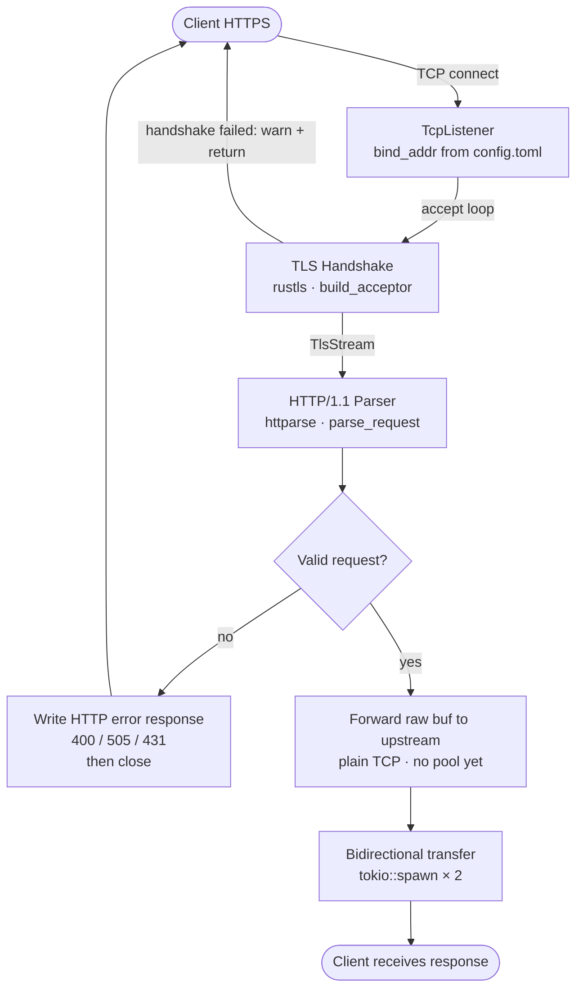

# Phase 1a — TLS + Request Forwarding

> Status: **Complete** — proxy accepts TLS connections, parses HTTP/1.1, forwards to upstream, transfers response back to client.

---

## What was built



---

## Module structure

```
src/
├── main.rs                        — tokio runtime · config load · listener::run
├── config.rs                      — Config · TlsConfig · UpstreamConfig · load_from_file
├── tls.rs                         — build_acceptor · load_cert_chain · load_private_key · build_server_config
├── listener.rs                    — run · serve_connection
├── http_codec.rs                  — ParsedRequest · parse_request · validate_framing · validate_version
└── errors/
    ├── mod.rs
    ├── config_error.rs
    ├── tls_error.rs
    ├── codec_error.rs
    └── listener_error.rs
```

---

## Key decisions made during implementation

### Error types — design for callers, not for documentation

The first attempt at `tls_error.rs` mirrored every variant of `rustls::Error` into a custom enum, including a manual `From` impl and a `_ => todo!()` catch-all. That is a maintenance trap — when rustls adds a new variant, the `todo!()` panics in production.

The correct approach: use `#[from]` to convert the library error automatically and add only the variants your caller acts on differently.

```rust
#[derive(Debug, Error)]
pub enum TlsError {
    #[error("IO error: {0}")]
    Io(#[from] std::io::Error),
    #[error("PEM parse error: {0}")]
    PemParseError(String),
    #[error("no certificates found: {0}")]
    NoCertificatesFound(PathBuf),
    #[error("no private key found: {0}")]
    NoPrivateKeyFound(PathBuf),
    #[error("invalid certificate: {0}")]
    InvalidCertificate(String),
    #[error("invalid private key: {0}")]
    InvalidPrivateKey(String),
    #[error("TLS config error: {0}")]
    Config(#[from] rustls::Error),
}
```

**Rule:** before adding an error variant, complete the sentence: *"When I see this error, I will ___."* If the blank is identical for two variants, merge them.

### `anyhow` vs `thiserror`

| Situation | Use |
| --- | --- |
| Module with its own error type | `thiserror` |
| `main.rs` top-level startup | `anyhow` |
| Test code | `anyhow` |

`anyhow::Result<T, E>` is not a real type. `anyhow::Result<T>` is `Result<T, anyhow::Error>`. If you have your own error type, use `Result<T, YourError>`.

### Build once at startup, share across connections

`TlsAcceptor` reads cert files from disk and builds a `ServerConfig`. This is expensive. It must happen once in `run()`, not once per connection.

```rust
pub async fn run(config: Arc<Config>) -> Result<(), ListenerError> {
    // Built once here
    let acceptor = build_acceptor(Arc::new(config.tls.clone()))
        .map_err(|err| ListenerError::TlsSetup(err.to_string()))?;
    let acceptor = Arc::new(acceptor);

    let listener = TcpListener::bind(config.addr).await?;

    loop {
        match listener.accept().await {
            Ok((stream, peer_addr)) => {
                // Cloned cheaply per connection — Arc clone is a reference count increment
                let acceptor = Arc::clone(&acceptor);
                let config = Arc::clone(&config);
                tokio::spawn(serve_connection(stream, peer_addr, config, acceptor));
            }
            Err(err) => {
                // Transient OS error — log and continue, never break the loop
                tracing::error!(error = %err, "accept failed");
            }
        }
    }
}
```

### Log levels are a contract

| Level | Meaning | Example |
| --- | --- | --- |
| `error` | Something wrong with SROx | `accept()` failed, upstream connect failed |
| `warn` | Something wrong with the client | TLS handshake failed, bad framing |
| `info` | Normal significant events | Proxy started, transfer complete |
| `debug` | Diagnostic detail | Request parsed, cache key |

### Forward raw bytes, not parsed body

The first implementation forwarded `parsed.body` to upstream:

```rust
// Wrong — sends only the body, upstream never sees the HTTP request line or headers
upstream.write_all(&parsed.body).await
```

The upstream is an HTTP server. It needs to receive a complete HTTP request — request line, headers, and body. The fix is to forward the raw buffer:

```rust
// Right — sends the complete HTTP request as received
upstream.write_all(&buf).await
```

`ParsedRequest` is used for **validation only** in Phase 1a. The raw bytes are what gets forwarded.

### Reject with a proper HTTP response

When parsing fails, the first implementation called `return` and left the client in limbo. The client would render stale bytes or hang. The fix: always write an HTTP error response before dropping the connection.

```rust
let parsed = match parse_request(&buf) {
    Ok(p) => p,
    Err(CodecError::AmbiguousFraming) => {
        let _ = tls_stream.write_all(
            b"HTTP/1.1 400 Bad Request\r\nContent-Length: 0\r\nConnection: close\r\n\r\n"
        ).await;
        return;
    }
    Err(CodecError::InvalidHttpVersion(_)) => {
        let _ = tls_stream.write_all(
            b"HTTP/1.1 505 HTTP Version Not Supported\r\nContent-Length: 0\r\nConnection: close\r\n\r\n"
        ).await;
        return;
    }
    Err(CodecError::RequestTooLarge) => {
        let _ = tls_stream.write_all(
            b"HTTP/1.1 431 Request Header Fields Too Large\r\nContent-Length: 0\r\nConnection: close\r\n\r\n"
        ).await;
        return;
    }
    Err(_) => {
        let _ = tls_stream.write_all(
            b"HTTP/1.1 400 Bad Request\r\nContent-Length: 0\r\nConnection: close\r\n\r\n"
        ).await;
        return;
    }
};
```

---

## What the implementation proved

```bash
# Valid request forwarded correctly
curl --insecure https://localhost:8443/api/test
# → 404 from Python upstream (correct — /api/test does not exist)

# Root path forwarded correctly
curl --insecure https://localhost:8443/
# → 200 directory listing from Python upstream

# Smuggling attempt rejected before reaching upstream
curl --insecure https://localhost:8443/ \
  -H "Content-Length: 5" \
  -H "Transfer-Encoding: chunked"
# → HTTP 400 Bad Request

# Proxy logs (structured JSON)
{"timestamp":"...","level":"INFO","fields":{"message":"SROx starting"}}
{"timestamp":"...","level":"INFO","fields":{"message":"listening","addr":"127.0.0.1:8443"}}
{"timestamp":"...","level":"INFO","fields":{"message":"proxy transfer complete","peer":"127.0.0.1:58604"}}
```

---

## Known limitations going into Phase 1b

| Limitation | Phase that fixes it |
| --- | --- |
| No trace_id on any log line | 1b |
| No Prometheus metrics endpoint | 1b |
| No structured request log (method, path, status, duration) | 1b |
| Single `read_buf` call — large requests may be silently truncated | 2 |
| New TCP connection to upstream per request — no pooling | 2 |
| No `Host` header forwarded to upstream | 2 |
| No `X-Forwarded-For` header | 2 |

---

## Bugs found and fixed

| Bug | Symptom | Fix |
| --- | --- | --- |
| `tls_error.rs` mirrored every rustls variant | `_ => todo!()` landmine, unmaintainable | Replaced with 7-variant enum using `#[from]` |
| `build_acceptor` called per connection | Disk read on every client connect | Moved to `run()`, wrapped in `Arc` |
| `anyhow::Result<T, E>` used as return type | Does not compile — `anyhow::Result` takes one type parameter | Changed to `Result<T, TlsError>` throughout |
| `parsed.body` forwarded to upstream | Upstream received empty body, responded with errors | Changed to forward raw `buf` |
| No HTTP response on parse failure | Client left in limbo, rendered stale bytes | Added explicit error response writes before `return` |

---

## Revision history

| Date | Version | Note |
| --- | --- | --- |
| April 2026 | 0.1 | Phase 1a plan written pre-implementation |
| April 2026 | 0.2 | Added naming conventions, data structure guidance, mermaid diagrams |
| April 2026 | 0.3 | Added error design philosophy, startup vs per-connection distinction, log level guide |
| April 2026 | 0.4 | Retrospective rewrite — implementation complete, bugs documented, lessons captured |