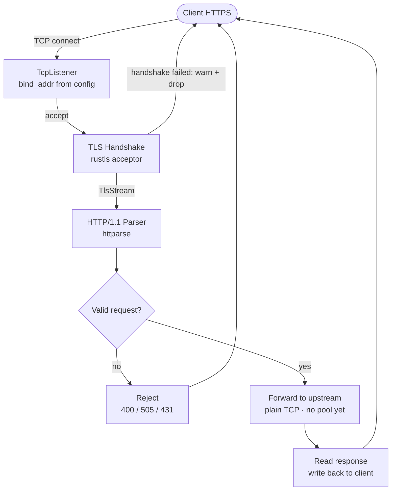
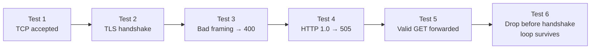

# Phase 1a — TLS + Request Forwarding

> Your only job this phase: a client sends an HTTPS request, SROx forwards it to an upstream, the response comes back. That's it. Nothing else ships until that works and is tested.

---

## How to think about this phase

You are not building a proxy yet. You are building the **foundation that the proxy will stand on**. Every decision you make here — how you handle errors, how you structure config, how you log — will echo through every phase that follows.

A production engineer starting a new service does not write the feature first and clean up later. They ask: _what does this need to be correct, observable, and safe to run?_ Answer that question before you write the function.

**Production mindset for this phase means:**

- No `unwrap()` in any code path that can be reached by a client. Panics take down the whole proxy, not just one connection.
- Every error is either handled or propagated with context. "Connection reset by peer" is not a crash — it is a log line and a continue.
- The config is the single source of truth. The bind address lives in one place. Not in `main`, not hardcoded in a test, not in two places that can drift.
- A test is not "I ran it and it seemed to work." A test is an assertion that will catch a regression six weeks from now when you have forgotten this code exists.
- If something is temporary, it is either a `// TODO(phase-N): reason` comment, or it does not exist. No silent shortcuts.

---

## What you are building



No caching. No circuit breaker. No pool. One upstream, defined in config. That comes later.

---

## Naming conventions

Consistent naming is not style — it is how you communicate intent to the next person reading the code, which is usually you, six weeks later.

### Functions

| Pattern                    | Use when                                           | Example                                |
| -------------------------- | -------------------------------------------------- | -------------------------------------- |
| `noun_verb` or `verb_noun` | Transformations and constructors                   | `config_from_file`, `acceptor_build`   |
| `handle_*`                 | Entry point for a spawned task                     | `handle_connection`, `handle_request`  |
| `parse_*`                  | Takes raw bytes, returns structured data           | `parse_request`, `parse_headers`       |
| `validate_*`               | Takes structured data, returns `Result<(), Error>` | `validate_config`, `validate_framing`  |
| `reject_*`                 | Writes an error response to the client             | `reject_bad_request`, `reject_version` |
| `load_*`                   | Reads from disk or external source                 | `load_cert_chain`, `load_private_key`  |

**Rules:**

- No abbreviations. `cfg` is not `config`. `addr` is acceptable for `SocketAddr` — it is universally understood in networking code.
- Async functions that run for the lifetime of a connection are named `run_*` or `serve_*`. Example: `serve_connection`.
- Boolean-returning functions start with `is_` or `has_`. Example: `is_chunked`, `has_content_length`.

### Types and structs

| What it is                    | Naming          | Example                                     |
| ----------------------------- | --------------- | ------------------------------------------- |
| Config holder                 | Noun, no suffix | `Config`, `TlsConfig`, `UpstreamConfig`     |
| Error type per module         | `ModuleError`   | `ConfigError`, `TlsError`, `CodecError`     |
| Parsed HTTP request           | `ParsedRequest` | Avoids confusion with `http::Request`       |
| A connection in progress      | `Connection`    | Held for the duration of one client session |
| A result that carries context | Use `thiserror` | Never `Box<dyn Error>` in library code      |

**Rules:**

- No `Manager`, `Handler`, `Helper`, `Util`, or `Service` in type names unless the type genuinely models that concept from the domain. These names say nothing about what the type does.
- Structs that own a resource (a socket, a file, a TLS stream) are named after the resource, not the operation. `Connection`, not `ConnectionHandler`.
- Enums for errors are exhaustive. Every variant is a specific failure, not a catch-all. No `Other(String)` unless you genuinely have no better option.

### Variables

- `stream` for a raw `TcpStream`
- `tls_stream` after wrapping in TLS
- `peer_addr` for the client's `SocketAddr`
- `req` for a `ParsedRequest`
- `config` — never `cfg`, `conf`, or `c`
- Loop indices: `i` is fine. But `n_bytes`, `n_headers` are better than `n` when the count means something.

---

## When to use an external crate vs std

This decision comes up constantly. Here is the rule: **use std until std cannot do the job, then reach for the smallest crate that can.**

### Use std

| Situation                               | std type                                                      |
| --------------------------------------- | ------------------------------------------------------------- |
| Key-value lookup, known at compile time | `std::collections::HashMap`                                   |
| A queue of tasks                        | `std::collections::VecDeque`                                  |
| A sorted set                            | `std::collections::BTreeMap`                                  |
| Reading a file                          | `std::fs::File` + `std::io::BufReader`                        |
| Byte buffers you own                    | `Vec<u8>`                                                     |
| Shared ownership across threads         | `std::sync::Arc`                                              |
| Interior mutability with locking        | `std::sync::RwLock` (prefer over `Mutex` for read-heavy data) |

### Use an external crate — and why

| Situation                                   | Crate                              | Why not std                                                                                        |
| ------------------------------------------- | ---------------------------------- | -------------------------------------------------------------------------------------------------- |
| Async TCP sockets                           | `tokio::net::TcpListener`          | std sockets are blocking. Async requires tokio's runtime.                                          |
| TLS streams                                 | `tokio_rustls::TlsAcceptor`        | std has no TLS.                                                                                    |
| HTTP header parsing                         | `httparse`                         | Parsing HTTP correctly from bytes is non-trivial. Writing your own is a security risk.             |
| Byte buffers shared across async boundaries | `bytes::Bytes` / `bytes::BytesMut` | `Vec<u8>` clones on every ownership transfer. `Bytes` uses reference counting — zero-copy slicing. |
| Error types with context                    | `thiserror`                        | std `Error` trait requires boilerplate. `thiserror` derives it cleanly.                            |
| Propagating errors in `main` or tests       | `anyhow`                           | For application-level code where you want context chains, not for library code.                    |
| Structured logging                          | `tracing`                          | `println!` does not give you log levels, trace IDs, or JSON output.                                |

### The decision test

Before adding a dependency, answer three questions:

1. **Can std do this correctly and safely?** If yes, use std.
2. **Is the crate widely used and maintained?** Check crates.io downloads and the last commit date. If it looks abandoned, keep looking.
3. **Is the crate doing something I could not safely do myself in a day?** HTTP parsing: yes. A simple ring buffer: no.

### Specific to Phase 1a

You need `bytes::BytesMut` for your read buffer. Here is why: when you read from a `TlsStream` into a `Vec<u8>` and then parse headers, the parsed header values are slices pointing into that `Vec`. The moment you hand the `Vec` to another function, the borrow checker will fight you. `BytesMut` is designed for this — you fill it, freeze it with `.freeze()` into a `Bytes`, and hand out cheap reference-counted slices without copying.

You do not need `bytes` for anything else in Phase 1a. Do not reach for it beyond the read buffer.

---

## The order you build it

### Step 1 — Config struct

Before a listener, before a socket, write the config.

```rust
// src/config.rs

pub struct Config {
    pub bind_addr: SocketAddr,
    pub tls: TlsConfig,
    pub upstream: UpstreamConfig,
}

pub struct TlsConfig {
    pub cert_path: PathBuf,
    pub key_path:  PathBuf,
}

pub struct UpstreamConfig {
    pub addr: SocketAddr,
}

impl Config {
    pub fn from_file(path: &Path) -> Result<Self, ConfigError> {
        // 1. read file
        // 2. parse TOML
        // 3. validate — cert file exists? bind addr parseable?
        // 4. return Ok(config) or Err(ConfigError::...)
    }
}
```

**The rule:** if `Config::from_file` returns `Ok`, the config is usable. If it returns `Err`, log and exit. No partial configs, no defaults that silently mask a misconfiguration.

---

### Step 2 — TCP listener

```rust
// src/listener.rs

pub async fn run(config: Arc<Config>) -> Result<(), ListenerError> {
    let listener = TcpListener::bind(config.bind_addr).await?;
    loop {
        match listener.accept().await {
            Ok((stream, peer_addr)) => {
                let config = Arc::clone(&config);
                tokio::spawn(serve_connection(stream, peer_addr, config));
            }
            Err(e) => {
                // transient OS error — log and continue, do not exit
                tracing::error!(error = %e, "accept failed");
            }
        }
    }
}
```

The `Err` branch is the important one. `accept()` fails on transient OS errors. That is not a reason to bring down the proxy.

Note `Arc<Config>` — the config is read-only after startup and shared across all connection tasks. `Arc` with no lock is the right tool: multiple readers, zero writers.

---

### Step 3 — TLS handshake

```rust
// src/tls.rs

pub fn build_acceptor(config: &TlsConfig) -> Result<TlsAcceptor, TlsError> {
    // load_cert_chain(&config.cert_path)?
    // load_private_key(&config.key_path)?
    // build ServerConfig: min TLS 1.2, no 0-RTT
    // return TlsAcceptor
}
```

In `serve_connection`:

```rust
let tls_stream = match acceptor.accept(stream).await {
    Ok(s) => s,
    Err(e) => {
        // bad client — warn, not error
        tracing::warn!(peer = %peer_addr, error = %e, "TLS handshake failed");
        return;
    }
};
```

A failed TLS handshake is not an error in your proxy — it is a bad client. The log level distinction matters: `error` means something is wrong with SROx. `warn` means something was wrong with the client.

---

### Step 4 — HTTP/1.1 parsing

```rust
// src/http_codec.rs

pub struct ParsedRequest {
    pub method:  String,
    pub path:    String,
    pub version: u8,
    pub headers: Vec<(String, String)>,
    pub body:    Bytes,
}

pub fn parse_request(buf: &BytesMut) -> Result<ParsedRequest, CodecError> {
    // use httparse to parse headers
    // validate_framing(&headers)?   ← Content-Length vs Transfer-Encoding check
    // validate_version(version)?    ← reject HTTP/1.0
    // validate_header_size(buf)?    ← reject if > 8KB
}

fn validate_framing(headers: &[httparse::Header]) -> Result<(), CodecError> {
    // if both Content-Length and Transfer-Encoding present → CodecError::AmbiguousFraming
}
```

**Rejection table**

| Condition                                             | Response                              |
| ----------------------------------------------------- | ------------------------------------- |
| Both `Content-Length` and `Transfer-Encoding` present | `400 Bad Request`                     |
| HTTP version 1.0 or lower                             | `505 HTTP Version Not Supported`      |
| Headers exceed 8KB                                    | `431 Request Header Fields Too Large` |
| Parse fails entirely                                  | `400 Bad Request`                     |

These are not edge cases. These are the smuggling boundary. Enforce them from day one.

---

### Step 5 — Forward to upstream

```rust
// in serve_connection, after parse_request succeeds

let mut upstream = TcpStream::connect(config.upstream.addr).await
    .map_err(|e| { tracing::error!(error = %e, "upstream connect failed"); e })?;

// write request bytes to upstream
// read response from upstream
// write response back to tls_stream
```

No pool yet. A new TCP connection per request is fine for Phase 1a. What matters now is that the forwarding path works and the bytes are correct.

---

### Step 6 — Write the tests

Do not move on until these pass.



**Test 1 — TCP connection is accepted**
Bind the listener. Open a raw TCP connection. Assert the connection is accepted without error.

**Test 2 — TLS handshake completes**
Use `rcgen` to generate a self-signed cert in the test setup. Connect with a TLS client that trusts that cert. Assert the handshake succeeds.

**Test 3 — Invalid framing is rejected**
Send a request with both `Content-Length` and `Transfer-Encoding`. Assert you get back `400 Bad Request`.

**Test 4 — HTTP/1.0 is rejected**
Send an HTTP/1.0 request. Assert you get back `505`.

**Test 5 — Valid request is forwarded**
Spin up a minimal TCP server as the upstream. Send a valid GET request through SROx. Assert the response comes back correctly.

**Test 6 — Accept loop survives a bad client**
Connect to the listener and immediately drop the connection before the TLS handshake. Assert the listener is still accepting new connections afterward.

---

## What the deliverable looks like

```bash
# This works
curl --insecure https://localhost:8443/api/test
# → response from upstream

# This is rejected
curl --insecure https://localhost:8443/ \
  -H "Content-Length: 5" \
  -H "Transfer-Encoding: chunked"
# → HTTP 400

# All tests pass
cargo test
# test result: ok. 6 passed; 0 failed
```

---

## What you are not building yet

Do not be tempted. Everything below has a phase.

| Feature              | Phase |
| -------------------- | ----- |
| Connection pooling   | 2     |
| Health checks        | 2     |
| Prometheus metrics   | 1b    |
| OpenTelemetry traces | 1b    |
| Caching              | 3     |
| Circuit breaker      | 4     |
| Retry logic          | 4     |

If you find yourself reaching for any of these, write a `// TODO(phase-N): reason` comment and move on. The discipline of not over-building is as important as the discipline of building correctly.

---

## Files you will create

```
src/
├── main.rs         — parse config, build acceptor, run listener
├── config.rs       — Config · TlsConfig · UpstreamConfig · from_file() · validation
├── listener.rs     — run() · serve_connection()
├── tls.rs          — build_acceptor() · load_cert_chain() · load_private_key()
├── http_codec.rs   — ParsedRequest · parse_request() · validate_framing() · reject_*()
└── error.rs        — ConfigError · TlsError · CodecError · ListenerError

tests/
└── phase1a.rs      — the six tests above

config.toml         — example config for local development
certs/              — gitignored · generated by rcgen in tests
```

---

## Questions to answer before you write a function

1. What does success look like for this function?
2. What are the ways it can fail?
3. What should happen to the connection — and to the proxy — when it fails?
4. How will I know it works?

If you cannot answer all four, you are not ready to write the function yet.

---

## Revision history

| Date       | Version | Note                                                                |
| ---------- | ------- | ------------------------------------------------------------------- |
| April 2026 | 0.1     | Phase 1a plan written pre-implementation                            |
| April 2026 | 0.2     | Added naming conventions, data structure guidance, mermaid diagrams |
| —          | 0.3     | Update after implementation: what matched, what changed, why        |
