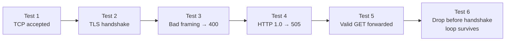

# Phase 1a — TLS + Request Forwarding

> Your only job this phase: a client sends an HTTPS request, SROx forwards it to an upstream, the response comes back. That's it. Nothing else ships until that works and is tested.

---

## How to think about this phase

You are not building a proxy yet. You are building the **foundation that the proxy will stand on**. Every decision you make here — how you handle errors, how you structure config, how you log — will echo through every phase that follows.

A production engineer starting a new service does not write the feature first and clean up later. They ask: _what does this need to be correct, observable, and safe to run?_ Answer that question before you write the function.

**Production mindset for this phase means:**

- No `unwrap()` or `expect()` in any code path that can be reached by a client. Panics take down the whole proxy, not just one connection.
- Every error is either handled or propagated with context. "Connection reset by peer" is not a crash — it is a log line and a `return`.
- The config is the single source of truth. The bind address lives in one place. Not in `main`, not hardcoded in a test, not in two places that can drift.
- A test is not "I ran it and it seemed to work." A test is an assertion that will catch a regression six weeks from now when you have forgotten this code exists.
- If something is temporary, it is either a `// TODO(phase-N): reason` comment, or it does not exist. No silent shortcuts.

---

## What you are building


No caching. No circuit breaker. No pool. One upstream, defined in config. That comes later.

---

## Naming conventions

Consistent naming is not style — it is how you communicate intent to the next person reading the code, which is usually you, six weeks later.

### Functions

| Pattern             | Use when                                           | Example                                 |
| ------------------- | -------------------------------------------------- | --------------------------------------- |
| `handle_*`          | Entry point for a spawned task                     | `handle_connection`, `handle_request`   |
| `serve_*` / `run_*` | Long-running async loop                            | `serve_connection`, `run`               |
| `parse_*`           | Takes raw bytes, returns structured data           | `parse_request`, `parse_headers`        |
| `validate_*`        | Takes structured data, returns `Result<(), Error>` | `validate_config`, `validate_framing`   |
| `reject_*`          | Writes an error response to the client             | `reject_bad_request`                    |
| `load_*`            | Reads from disk or external source                 | `load_cert_chain`, `load_private_key`   |
| `build_*`           | Constructs a complex value from parts              | `build_acceptor`, `build_server_config` |
| `is_*` / `has_*`    | Returns `bool`                                     | `is_chunked`, `has_content_length`      |

**Rules:**

- No abbreviations. `cfg` is not `config`. `addr` is acceptable for `SocketAddr` — it is universally understood in networking code.
- No `Manager`, `Handler`, `Helper`, `Util` in type names unless the type genuinely models that concept.
- Structs that own a resource are named after the resource. `Connection`, not `ConnectionHandler`.

### Variables

- `stream` for a raw `TcpStream`
- `tls_stream` after wrapping in TLS
- `peer_addr` for the client's `SocketAddr`
- `req` for a `ParsedRequest`
- `config` — never `cfg`, `conf`, or `c`

---

## When to use an external crate vs std

**Use std until std cannot do the job. Then reach for the smallest crate that can.**

### Use std

| Situation                       | std type                     |
| ------------------------------- | ---------------------------- |
| Key-value lookup                | `std::collections::HashMap`  |
| A queue                         | `std::collections::VecDeque` |
| Byte buffers you own            | `Vec<u8>`                    |
| Shared ownership across threads | `std::sync::Arc`             |
| Interior mutability, read-heavy | `std::sync::RwLock`          |

### Use an external crate — and why

| Situation                            | Crate                       | Why not std                                       |
| ------------------------------------ | --------------------------- | ------------------------------------------------- |
| Async TCP sockets                    | `tokio::net::TcpListener`   | std sockets are blocking                          |
| TLS streams                          | `tokio_rustls::TlsAcceptor` | std has no TLS                                    |
| HTTP header parsing                  | `httparse`                  | Writing your own is a security risk               |
| Byte buffers across async boundaries | `bytes::BytesMut`           | `Vec<u8>` clones on every ownership transfer      |
| Error types with context             | `thiserror`                 | std `Error` requires boilerplate                  |
| Error propagation in `main`          | `anyhow`                    | For application code only — not library functions |

### The decision test

Before adding a dependency, answer three questions:

1. Can std do this correctly and safely? If yes, use std.
2. Is the crate widely used and maintained?
3. Is it doing something I could not safely do myself in a day? HTTP parsing: yes. A simple counter: no.

---

## How to design error types

This is the lesson most people learn the hard way. Read it before you write a single error enum.

### The rule

**Design error types for your callers, not for documentation.**

Ask one question before adding an error variant: _given this error, what does my caller do differently?_

If the answer is the same for ten variants — "log a warning and return" — those ten variants should be one variant. You are not writing a mirror of the library you depend on. You are communicating what went wrong in terms your caller can act on.

### The trap to avoid

When you see a large enum in a library (like `rustls::Error`), the instinct is to map every variant into your own error type. Resist this. You get:

- A second large enum you now maintain in sync with the library forever
- A `_ => todo!()` catch-all that panics in production when the library adds a new variant
- Callers that cannot act on the granularity anyway

### What to do instead

Use `#[from]` to let `thiserror` convert the library error automatically. The full error message is preserved. You write nothing manually.

```rust
// Wrong — mirroring rustls::Error variant by variant
#[derive(Debug, Error)]
pub enum TlsError {
    PeerMisbehaved(rustls::PeerMisbehaved),
    AlertReceived(rustls::AlertDescription),
    DecryptError,
    // ... 20 more variants ...
    _ => todo!() // landmine
}

// Right — your caller logs and returns regardless of which rustls variant it is
#[derive(Debug, Error)]
pub enum TlsError {
    #[error("IO error: {0}")]
    Io(#[from] std::io::Error),

    #[error("PEM parse error: {0}")]
    PemParse(String),

    #[error("no certificates found in: {0}")]
    NoCertificatesFound(PathBuf),

    #[error("no private key found in: {0}")]
    NoPrivateKeyFound(PathBuf),

    #[error("invalid private key: {0}")]
    InvalidPrivateKey(String),

    #[error("TLS configuration error: {0}")]
    Config(#[from] rustls::Error),
}
```

Six variants. Full error messages. No manual `From` impl. No landmine. When rustls adds a new variant, you do nothing.

### The granularity test

For each error variant you are about to add, complete this sentence:

> "When I see this error, I will ****\_\_\_****."

If the blank is identical for two variants, merge them. If the blank is "log it and move on," one variant is enough.

### `anyhow` vs `thiserror` — when to use which

| Situation                                                         | Use         |
| ----------------------------------------------------------------- | ----------- |
| A module with its own error type (tls, codec, config)             | `thiserror` |
| `main.rs` — top-level startup errors                              | `anyhow`    |
| Test code                                                         | `anyhow`    |
| A function that returns `Result` but the caller only ever logs it | `anyhow`    |

Never use `anyhow::Result<T, E>` — that is not a real type. `anyhow::Result<T>` is `Result<T, anyhow::Error>`. If you have your own error type, use `Result<T, YourError>`.

---

## Startup vs per-connection: where things are built

This is a subtle but critical distinction.

**Built once at startup, shared across all connections:**

- `TlsAcceptor` — reading cert files from disk and building a `ServerConfig` is expensive. Do it once in `run()`, wrap in `Arc`, clone cheaply per connection.
- `Arc<Config>` — config is read-only after startup. One allocation, many readers, no lock needed.

**Built once per connection:**

- The TLS stream — each connection has its own handshake
- The parsed request — each request is unique
- The upstream TCP connection — one per request in Phase 1a (pool comes in Phase 2)

**The mistake to avoid:**

```rust
// Wrong — cert files read from disk on every connection
async fn serve_connection(stream: TcpStream, config: Arc<Config>) {
    let acceptor = build_acceptor(Arc::new(config.tls.clone())).expect("...");
    //                            ^^^^^^^^^^^^^^^^^^^^^^^^^^^^^^^^^^^^^^^^^^^
    //                            This runs for every client. Expensive and wrong.
}

// Right — acceptor built once in run(), cloned per connection
pub async fn run(config: Arc<Config>) -> Result<(), ListenerError> {
    let acceptor = build_acceptor(Arc::new(config.tls.clone()))
        .map_err(|e| ListenerError::TlsSetup(e.to_string()))?;
    let acceptor = Arc::new(acceptor);

    let listener = TcpListener::bind(config.addr).await?;
    loop {
        match listener.accept().await {
            Ok((stream, peer_addr)) => {
                let acceptor = Arc::clone(&acceptor);
                let config = Arc::clone(&config);
                tokio::spawn(serve_connection(stream, peer_addr, acceptor, config));
            }
            Err(e) => {
                tracing::error!(error = %e, "accept failed");
            }
        }
    }
}
```

---

## Log levels — what they mean

Every log level is a contract with the person debugging at 2am.

| Level   | Meaning                                            | Example in SROx                            |
| ------- | -------------------------------------------------- | ------------------------------------------ |
| `error` | Something is wrong with SROx itself                | `accept()` failed, upstream connect failed |
| `warn`  | Something was wrong with the client or environment | TLS handshake failed, bad request framing  |
| `info`  | Normal significant events                          | Proxy started, upstream added              |
| `debug` | Useful when diagnosing a specific issue            | Request parsed, cache key computed         |
| `trace` | Byte-level detail                                  | Raw bytes received                         |

The distinction between `error` and `warn` matters: `error` pages someone on your team. `warn` does not. Use them accordingly.

---

## The order you build it

### Step 1 — Error types first

Write `error.rs` before any other module. Every other module depends on it. Apply the granularity test to every variant before you add it.

```rust
// src/error.rs — one file, all error types for Phase 1a

pub use config_error::ConfigError;
pub use tls_error::TlsError;
pub use codec_error::CodecError;
pub use listener_error::ListenerError;
```

Or keep them in their respective modules (`config.rs`, `tls.rs`, etc.) — either works. What matters is that they exist before you write the functions that return them.

---

### Step 2 — Config struct

```rust
// src/config.rs

pub struct Config {
    pub addr: SocketAddr,
    pub tls: TlsConfig,
    pub upstream: UpstreamConfig,
}

pub struct TlsConfig {
    pub cert_path: PathBuf,
    pub private_key: PathBuf,
}

pub struct UpstreamConfig {
    pub addr: SocketAddr,
}

impl Config {
    pub fn load_from_file(path: &Path) -> Result<Self, ConfigError> {
        let file = fs::read_to_string(path)?;
        let config: Config = toml::from_str(&file)?;

        if !config.tls.cert_path.exists() {
            return Err(ConfigError::CertNotFound(config.tls.cert_path.clone()));
        }
        if !config.tls.private_key.exists() {
            return Err(ConfigError::KeyNotFound(config.tls.private_key.clone()));
        }

        Ok(config)
    }
}
```

**The rule:** if `load_from_file` returns `Ok`, the config is usable. Full stop.

---

### Step 3 — TLS acceptor

```rust
// src/tls.rs

pub(crate) fn build_acceptor(config: Arc<TlsConfig>) -> Result<TlsAcceptor, TlsError> {
    let cert_chain = load_cert_chain(&config.cert_path)?;
    let private_key = load_private_key(&config.private_key)?;
    let server_config = build_server_config(cert_chain, private_key)?;
    Ok(TlsAcceptor::from(server_config))
}

fn load_cert_chain(path: &Path) -> Result<Vec<CertificateDer<'static>>, TlsError> {
    let bytes = fs::read(path)?;
    let certs = pem::parse_many(bytes)
        .map_err(|e| TlsError::PemParse(e.to_string()))?
        .into_iter()
        .filter(|p| p.tag() == "CERTIFICATE")
        .map(|p| CertificateDer::from(p.into_contents()))
        .collect::<Vec<_>>();

    if certs.is_empty() {
        return Err(TlsError::NoCertificatesFound(path.to_path_buf()));
    }
    Ok(certs)
}

fn load_private_key(path: &Path) -> Result<PrivateKeyDer<'static>, TlsError> {
    let bytes = fs::read(path)?;
    let key = pem::parse_many(bytes)
        .map_err(|e| TlsError::PemParse(e.to_string()))?
        .into_iter()
        .find(|p| matches!(p.tag(), "PRIVATE KEY" | "RSA PRIVATE KEY" | "EC PRIVATE KEY"))
        .ok_or_else(|| TlsError::NoPrivateKeyFound(path.to_path_buf()))?;

    PrivateKeyDer::try_from(key.into_contents())
        .map_err(|e| TlsError::InvalidPrivateKey(e.to_string()))
}

fn build_server_config(
    certs: Vec<CertificateDer<'static>>,
    key: PrivateKeyDer<'static>,
) -> Result<Arc<ServerConfig>, TlsError> {
    let config = ServerConfig::builder()
        .with_no_client_auth()
        .with_single_cert(certs, key)?;
    Ok(Arc::new(config))
}
```

---

### Step 4 — Listener

Build the acceptor once. Share it.

```rust
// src/listener.rs

pub(crate) async fn run(config: Arc<Config>) -> Result<(), ListenerError> {
    let acceptor = build_acceptor(Arc::new(config.tls.clone()))
        .map_err(|e| ListenerError::TlsSetup(e.to_string()))?;
    let acceptor = Arc::new(acceptor);

    let listener = TcpListener::bind(config.addr).await?;
    tracing::info!(addr = %config.addr, "listening");

    loop {
        match listener.accept().await {
            Ok((stream, peer_addr)) => {
                let acceptor = Arc::clone(&acceptor);
                let config = Arc::clone(&config);
                tokio::spawn(serve_connection(stream, peer_addr, acceptor, config));
            }
            Err(e) => {
                tracing::error!(error = %e, "accept failed");
            }
        }
    }
}

async fn serve_connection(
    stream: TcpStream,
    peer_addr: SocketAddr,
    acceptor: Arc<TlsAcceptor>,
    config: Arc<Config>,
) {
    let tls_stream = match acceptor.accept(stream).await {
        Ok(s) => s,
        Err(e) => {
            tracing::warn!(peer = %peer_addr, error = %e, "TLS handshake failed");
            return;
        }
    };

    // TODO(phase-1a): parse request and forward to upstream
}
```

---

### Step 5 — HTTP/1.1 parsing

```rust
// src/http_codec.rs

pub fn parse_request(buf: &BytesMut) -> Result<ParsedRequest, CodecError> {
    if buf.len() > 8 * 1024 {
        return Err(CodecError::RequestTooLarge);
    }

    let mut headers = [httparse::EMPTY_HEADER; 64];
    let mut req = Request::new(&mut headers);

    match req.parse(buf.as_ref())? {
        httparse::Status::Complete(body_offset) => {
            let version = req.version.ok_or(CodecError::InvalidRequest)?;
            validate_version(version)?;
            validate_framing(req.headers)?;

            let headers = req
                .headers
                .iter()
                .map(|h| {
                    let name = h.name.to_string();
                    let value = String::from_utf8_lossy(h.value).to_string();
                    (name, value)
                })
                .collect();

            let body = Bytes::copy_from_slice(&buf[body_offset..]);

            Ok(ParsedRequest {
                method: req.method.ok_or(CodecError::InvalidRequest)?.to_string(),
                path: req.path.ok_or(CodecError::InvalidRequest)?.to_string(),
                version,
                headers,
                body,
            })
        }
        // Partial means the buffer did not contain a full set of headers.
        // For Phase 1a, treat this as an invalid request.
        // In a future phase, signal "need more data" to the caller.
        httparse::Status::Partial => Err(CodecError::InvalidRequest),
    }
}
```

---

### Step 6 — Forward to upstream

```rust
// inside serve_connection, after parse_request succeeds

let mut upstream = match TcpStream::connect(config.upstream.addr).await {
    Ok(s) => s,
    Err(e) => {
        tracing::error!(peer = %peer_addr, error = %e, "upstream connect failed");
        return;
    }
};

// TODO(phase-1a): write request bytes to upstream, read response, write back
```

No pool. No retry. One TCP connection per request. Correct for Phase 1a.

---

### Step 7 — Write the tests

Do not move on until these pass.



**Test 1 — TCP connection is accepted**
Bind the listener. Open a raw TCP connection. Assert it is accepted without error.

**Test 2 — TLS handshake completes**
Use `rcgen` to generate a self-signed cert in test setup. Connect with a TLS client that trusts it. Assert handshake succeeds.

**Test 3 — Invalid framing is rejected**
Send a request with both `Content-Length` and `Transfer-Encoding`. Assert `400 Bad Request`.

**Test 4 — HTTP/1.0 is rejected**
Send an HTTP/1.0 request. Assert `505 HTTP Version Not Supported`.

**Test 5 — Valid request is forwarded**
Spin up a minimal TCP server as the upstream. Send a valid GET request through SROx. Assert the response comes back correctly.

**Test 6 — Accept loop survives a bad client**
Connect and immediately drop the connection before the TLS handshake. Assert the listener is still accepting new connections afterward.

---

## What the deliverable looks like

```bash
# This works
curl --insecure https://localhost:8443/api/test
# → response from upstream

# This is rejected
curl --insecure https://localhost:8443/ \
  -H "Content-Length: 5" \
  -H "Transfer-Encoding: chunked"
# → HTTP 400

# All tests pass
cargo test
# test result: ok. 6 passed; 0 failed
```

---

## What you are not building yet

| Feature              | Phase |
| -------------------- | ----- |
| Connection pooling   | 2     |
| Health checks        | 2     |
| Prometheus metrics   | 1b    |
| OpenTelemetry traces | 1b    |
| Caching              | 3     |
| Circuit breaker      | 4     |
| Retry logic          | 4     |

If you find yourself reaching for any of these, write a `// TODO(phase-N): reason` comment and move on.

---

## Files you will create

```
src/
├── main.rs         — load config · build runtime · call listener::run
├── config.rs       — Config · TlsConfig · UpstreamConfig · ConfigError · load_from_file
├── tls.rs          — TlsError · build_acceptor · load_cert_chain · load_private_key · build_server_config
├── listener.rs     — ListenerError · run · serve_connection
├── http_codec.rs   — ParsedRequest · CodecError · parse_request · validate_framing · validate_version

tests/
└── phase1a.rs      — the six tests above

config.toml         — example config for local development
certs/              — gitignored · generated by rcgen in tests
```

---

## Questions to answer before you write a function

1. What does success look like for this function?
2. What are the ways it can fail?
3. What does my caller do differently for each failure? (granularity test)
4. What should happen to the connection — and to the proxy — when it fails?
5. How will I know it works?

If you cannot answer all five, you are not ready to write the function yet.

---

## Revision history

| Date       | Version | Note                                                                                                                                            |
| ---------- | ------- | ----------------------------------------------------------------------------------------------------------------------------------------------- |
| April 2026 | 0.1     | Phase 1a plan written pre-implementation                                                                                                        |
| April 2026 | 0.2     | Added naming conventions, data structure guidance, mermaid diagrams                                                                             |
| April 2026 | 0.3     | Added error design philosophy, startup vs per-connection distinction, log level guide, corrected listener and tls patterns based on code review |
