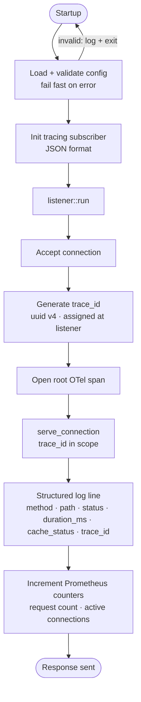

# Phase 1b — Observability + Config Validation

> Your job this phase: every request leaves a complete trail. A developer debugging a production issue can find the trace, the log lines, and the metrics for any request using only a `trace_id`. The proxy must also exit cleanly on bad config — never panic.

---

## What you are building



---

## Dependencies to add

```toml
# tracing already present — add the JSON layer and OTel bridge
tracing-subscriber = { version = "0.3", features = ["env-filter", "json"] }
tracing-opentelemetry = "0.25"
opentelemetry = { version = "0.24", features = ["trace"] }
opentelemetry_sdk = { version = "0.24", features = ["rt-tokio"] }
opentelemetry-otlp = { version = "0.17", features = ["tonic"] }
opentelemetry-semantic-conventions = "0.16"

# Prometheus
prometheus = "0.13"

# UUID for trace_id generation
uuid = { version = "1", features = ["v4"] }
```

---

## The order you build it

### Step 1 — Telemetry initialisation

Create `src/telemetry.rs`. This module owns startup of both the tracing subscriber and the OTel SDK. It is called once from `main` before anything else.

```rust
// src/telemetry.rs

pub fn init() -> anyhow::Result<()> {
    // 1. Build OTel tracer that exports to Jaeger via OTLP
    // 2. Build tracing subscriber: JSON format + OTel layer
    // 3. Set as global default
    // 4. Return Ok(())
}

pub fn shutdown() {
    // Flush remaining spans before process exits
    opentelemetry::global::shutdown_tracer_provider();
}
```

**Init order matters.** Tracing must be initialised before config loading, so that config errors appear in structured JSON, not as plain `eprintln`.

```rust
// main.rs
#[tokio::main]
async fn main() -> anyhow::Result<()> {
    telemetry::init()?;                    // first
    let config = Config::load_from_file(…)?; // second — errors now go through tracing
    listener::run(config).await?;
    telemetry::shutdown();                 // last — flush spans
    Ok(())
}
```

### Step 2 — trace_id generation and propagation

Every inbound connection gets a `trace_id` before any other processing. This is not optional and it is not per-request — it is per-connection at Phase 1b, per-request in later phases when you have proper HTTP pipelining support.

```rust
// In serve_connection, before the TLS handshake

use uuid::Uuid;

let trace_id = Uuid::new_v4().to_string();
let span = tracing::info_span!("connection", trace_id = %trace_id, peer = %socket_addr);
let _guard = span.enter();
```

Every `tracing::` call inside `serve_connection` after this point automatically inherits `trace_id` and `peer` as fields. You do not pass them manually.

**Forwarding trace_id to upstream:**

After parsing the request, inject the `traceparent` header before forwarding. For Phase 1b, reconstruct the request with the header appended:

```rust
// Reconstruct raw HTTP request with traceparent injected
// Format: traceparent: 00-{trace_id_hex_32}-{span_id_hex_16}-01
let traceparent = format!("00-{}-{}-01", trace_id_hex, span_id_hex);
```

W3C Trace Context format. The upstream receives it; Jaeger connects the spans.

Also set `X-Trace-Id` on the response back to the client:

```rust
// When writing the response header back to client, inject:
// X-Trace-Id: {trace_id}
```

### Step 3 — Structured request log

After the response is written, emit one structured log line per request. This is the log line that appears in your JSON output.

```rust
tracing::info!(
    trace_id = %trace_id,
    method = %parsed.method,
    path = %parsed.path,
    status = status_code,       // extracted from upstream response
    duration_ms = elapsed.as_millis(),
    cache_status = "MISS",      // always MISS in Phase 1b — cache comes in Phase 3
    "request complete"
);
```

**You need to extract `status_code` from the upstream response.** Right now you copy bytes blindly. Add a minimal response parser — just enough to read the status line:

```rust
fn parse_status_code(response_buf: &[u8]) -> u16 {
    // HTTP/1.1 200 OK\r\n...
    // Parse the first line, extract the three-digit code
    // Return 0 if the buffer is too short or malformed
}
```

### Step 4 — Prometheus metrics

Create `src/metrics.rs`. Register all metrics at startup. Expose `/metrics` endpoint on a separate port (not 8443 — that is your proxy port).

```rust
// src/metrics.rs

use prometheus::{
    register_histogram_vec, register_int_gauge, register_int_gauge_vec,
    HistogramVec, IntGauge, IntGaugeVec,
};

lazy_static::lazy_static! {
    pub static ref REQUEST_DURATION: HistogramVec = register_histogram_vec!(
        "srox_request_duration_seconds",
        "Request duration in seconds",
        &["method", "status_code", "cache_status"],
        vec![0.001, 0.005, 0.01, 0.025, 0.05, 0.1, 0.25, 0.5, 1.0, 2.5]
    ).unwrap();

    pub static ref ACTIVE_CONNECTIONS: IntGauge = register_int_gauge!(
        "srox_active_connections",
        "Number of active client connections"
    ).unwrap();
}
```

Add `lazy_static` to your dependencies:

```toml
lazy_static = "1"
```

**Increment/decrement `ACTIVE_CONNECTIONS` around the connection lifetime:**

```rust
// At the start of serve_connection
metrics::ACTIVE_CONNECTIONS.inc();

// At the end — use a drop guard pattern so it decrements even on early return
struct ConnectionGuard;
impl Drop for ConnectionGuard {
    fn drop(&mut self) {
        metrics::ACTIVE_CONNECTIONS.dec();
    }
}
let _guard = ConnectionGuard;
```

**Metrics HTTP server on a separate port:**

```rust
// src/metrics.rs

pub async fn serve_metrics(addr: SocketAddr) {
    // Bind a plain TCP listener on config.metrics_addr (e.g. 127.0.0.1:9090)
    // On any request, respond with:
    //   HTTP/1.1 200 OK
    //   Content-Type: text/plain; version=0.0.4
    //   [prometheus text output]
}
```

Add `metrics_addr` to your `Config`:

```toml
# config.toml
metrics_addr = "127.0.0.1:9090"
```

Spawn `metrics::serve_metrics` as a separate task in `main`, alongside `listener::run`:

```rust
tokio::select! {
    res = listener::run(Arc::clone(&config)) => res?,
    res = metrics::serve_metrics(config.metrics_addr) => res?,
}
```

### Step 5 — Config: explicit startup validation error messages

Right now a bad config exits but the error message may be cryptic. Improve it:

```rust
// main.rs
let config = Config::load_from_file(Path::new("config.toml"))
    .map_err(|err| {
        tracing::error!(
            error = %err,
            path = "config.toml",
            "failed to load config — fix the error above and restart"
        );
        err
    })?;
```

The message "fix the error above and restart" is for the operator, not the compiler. It communicates intent.

---

## Naming and structure guidance for this phase

### New module: `telemetry.rs`

Functions:

| Function | Signature | Purpose |
| --- | --- | --- |
| `init` | `() -> anyhow::Result<()>` | Initialise tracing + OTel SDK |
| `shutdown` | `()` | Flush spans on exit |

### New module: `metrics.rs`

| Function | Signature | Purpose |
| --- | --- | --- |
| `serve_metrics` | `(addr: SocketAddr) -> anyhow::Result<()>` | HTTP server for `/metrics` |

Metric names follow the pattern `srox_{noun}_{unit}`. No abbreviations. No generic names like `requests_total` without the `srox_` prefix.

### Drop guards for resource tracking

The `ConnectionGuard` pattern above is idiomatic Rust for "do this on exit regardless of how we exit." Use it for `ACTIVE_CONNECTIONS`. You will use it again for pool connection tracking in Phase 2.

---

## What the deliverable looks like

```bash
# Every request produces a structured JSON log line
curl --insecure https://localhost:8443/
# Server log:
# {"timestamp":"...","level":"INFO","fields":{
#   "message":"request complete",
#   "trace_id":"4bf92f3577b34da6a3ce929d0e0e4736",
#   "method":"GET","path":"/","status":200,
#   "duration_ms":4,"cache_status":"MISS"
# }}

# Metrics endpoint
curl http://localhost:9090/metrics
# srox_active_connections 0
# srox_request_duration_seconds_bucket{method="GET",status_code="200",cache_status="MISS",le="0.005"} 1
# ...

# Bad config exits cleanly
echo "addr = not-a-socket-addr" > config.toml && cargo run
# {"level":"ERROR","fields":{"message":"failed to load config","error":"..."}}
# process exits with code 1, no panic

# X-Trace-Id header on every response
curl --insecure -v https://localhost:8443/ 2>&1 | grep X-Trace-Id
# < X-Trace-Id: 4bf92f3577b34da6a3ce929d0e0e4736
```

---

## Tests to write

| Test | What it asserts |
| --- | --- |
| `trace_id_present_in_log` | Make a request, capture tracing output, assert `trace_id` field is present and is a valid UUID |
| `metrics_endpoint_reachable` | GET `http://localhost:9090/metrics` returns 200 and contains `srox_active_connections` |
| `active_connections_increments` | Open a connection, assert gauge is 1; close it, assert gauge is 0 |
| `request_duration_recorded` | Make a request, assert `srox_request_duration_seconds_count` is 1 |
| `bad_config_exits_cleanly` | Feed invalid TOML, assert process exits non-zero without panicking |

---

## What you are not building yet

| Feature | Phase |
| --- | --- |
| Connection pooling | 2 |
| Health checks | 2 |
| `X-Forwarded-For` header | 2 |
| In-memory cache | 3 |
| `X-Cache-Status` header | 3 |
| Circuit breaker | 4 |
| Retry logic | 4 |

---

## Files you will create or modify

```
src/
├── main.rs              — modified: init telemetry · spawn metrics server · shutdown on exit
├── telemetry.rs         — new: init · shutdown
├── metrics.rs           — new: metric definitions · serve_metrics
└── listener.rs          — modified: trace_id generation · span · request log · ConnectionGuard

config.toml              — add: metrics_addr field
```

---

## Revision history

| Date | Version | Note |
| --- | --- | --- |
| April 2026 | 0.1 | Phase 1b plan written after Phase 1a completion |