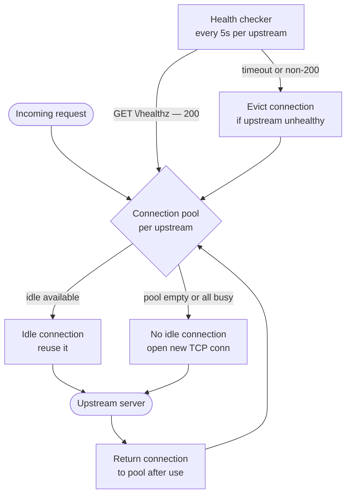

# Phase 2 — Connection Pools + Health Checks

> Phase 1 proved the proxy works. Phase 2 makes it production-worthy. Every request currently opens a new TCP connection to upstream and closes it when done. At any real traffic level that becomes the bottleneck. This phase fixes it.

---

## What you are building



---

## Why a connection pool matters

Opening a TCP connection costs a full round trip (SYN → SYN-ACK → ACK) plus any TCP slow-start overhead. At 1000 requests per second, that is 1000 unnecessary round trips every second. A pool keeps connections alive between requests and hands them out to whoever needs one.

The tradeoff: the pool holds state. A connection that has been idle for 60 seconds may have been closed by the upstream or a firewall — you will not know until you try to use it. The health checker catches this at the pool level so you never hand a dead connection to a request.

---

## New module: `src/pool.rs`

### Data structure decision

The pool is a collection of TCP connections per upstream address. You need:
- O(1) checkout (grab an idle connection)
- O(1) return (put it back)
- A maximum size enforced (no unbounded growth)
- Per-connection metadata: last-used timestamp, upstream addr

`std::collections::VecDeque<PooledConnection>` is the right choice. Pop from the front (oldest connection first — more likely to be stale, better to evict). Push to the back on return.

Do not reach for an external pool crate. The logic here is simple enough to own, and owning it means you can explain it in an interview.

### The pool struct

```rust
// src/pool.rs

use std::collections::VecDeque;
use std::net::SocketAddr;
use std::time::Instant;
use tokio::net::TcpStream;
use tokio::sync::Mutex;

pub struct PooledConnection {
    pub stream: TcpStream,
    pub last_used: Instant,
}

pub struct ConnectionPool {
    addr: SocketAddr,
    max_size: usize,
    keepalive_secs: u64,
    idle: Mutex<VecDeque<PooledConnection>>,
}

impl ConnectionPool {
    pub fn new(addr: SocketAddr, max_size: usize, keepalive_secs: u64) -> Self {
        Self {
            addr,
            max_size,
            keepalive_secs,
            idle: Mutex::new(VecDeque::new()),
        }
    }

    pub async fn checkout(&self) -> Result<PooledConnection, PoolError> {
        // ...
    }

    pub async fn checkin(&self, conn: PooledConnection) {
        // ...
    }

    pub async fn evict_stale(&self) {
        // ...
    }
}
```

### `checkout` logic

```
Lock the idle queue
While the front connection is older than keepalive_secs:
    pop and discard it  (stale — do not use)
If an idle connection remains:
    pop it and return it
Else:
    open a new TcpStream to self.addr
    return it
Unlock
```

### `checkin` logic

```
Lock the idle queue
If idle.len() >= max_size:
    drop the connection (pool is full)
Else:
    push to the back with last_used = Instant::now()
Unlock
```

### Why `tokio::sync::Mutex` not `std::sync::Mutex`

`std::sync::Mutex` blocks the thread when contended. In async code that means blocking the tokio thread pool — potentially deadlocking if the thread that holds the lock is waiting on an async operation. `tokio::sync::Mutex` yields to the runtime when contended. Use it for any mutex held across an `.await`.

---

## New module: `src/health.rs`

The health checker runs as a background task, independent of requests. It checks each upstream on a fixed interval and marks it healthy or unhealthy. The pool evicts connections to unhealthy upstreams.

### Health state

```rust
// src/health.rs

use std::sync::atomic::{AtomicBool, Ordering};
use std::sync::Arc;

pub struct UpstreamHealth {
    pub addr: SocketAddr,
    healthy: AtomicBool,
}

impl UpstreamHealth {
    pub fn new(addr: SocketAddr) -> Arc<Self> {
        Arc::new(Self {
            addr,
            healthy: AtomicBool::new(true), // optimistic start
        })
    }

    pub fn is_healthy(&self) -> bool {
        self.healthy.load(Ordering::Relaxed)
    }

    pub fn set_healthy(&self, val: bool) {
        self.healthy.store(val, Ordering::Relaxed);
    }
}
```

`AtomicBool` with `Ordering::Relaxed` is correct here. You are not synchronising memory access — you are publishing a flag. A slightly stale read (one check interval behind) is acceptable. This does not need a mutex.

### Health check loop

```rust
pub async fn run_health_check(
    health: Arc<UpstreamHealth>,
    interval_secs: u64,
    timeout_secs: u64,
) {
    let interval = Duration::from_secs(interval_secs);
    let mut ticker = tokio::time::interval(interval);

    loop {
        ticker.tick().await;

        let result = tokio::time::timeout(
            Duration::from_secs(timeout_secs),
            check_once(&health.addr),
        )
        .await;

        let was_healthy = health.is_healthy();
        let now_healthy = matches!(result, Ok(Ok(())));

        health.set_healthy(now_healthy);

        if was_healthy && !now_healthy {
            tracing::warn!(upstream = %health.addr, "upstream became unhealthy");
            metrics::UPSTREAM_HEALTHY
                .with_label_values(&[&health.addr.to_string()])
                .set(0);
        } else if !was_healthy && now_healthy {
            tracing::info!(upstream = %health.addr, "upstream recovered");
            metrics::UPSTREAM_HEALTHY
                .with_label_values(&[&health.addr.to_string()])
                .set(1);
        }
    }
}

async fn check_once(addr: &SocketAddr) -> Result<(), HealthError> {
    // Open a TCP connection
    // Send: GET /healthz HTTP/1.1\r\nHost: {addr}\r\nConnection: close\r\n\r\n
    // Read the status line
    // Return Ok if status is 2xx, Err otherwise
    // Drop the connection (do not return to pool)
}
```

The health check uses its own TCP connection — it does not borrow from the pool. A health check connection being open does not count against pool capacity.

---

## Wiring pool + health into `listener.rs`

`serve_connection` currently calls `TcpStream::connect` directly. Replace it:

```rust
// Before (Phase 1):
let mut upstream = TcpStream::connect(config.upstream.addr).await?;

// After (Phase 2):
let conn = pool.checkout().await
    .map_err(|e| { tracing::error!(error = %e, "pool checkout failed"); e })?;

// ... use conn.stream to forward the request ...

// After response is complete, return the connection:
pool.checkin(conn).await;
```

The pool is built once in `run()` alongside the acceptor and passed as `Arc<ConnectionPool>` into each `serve_connection` task.

---

## New metrics to add in `metrics.rs`

```rust
pub static UPSTREAM_HEALTHY: Lazy<IntGaugeVec> = Lazy::new(|| { ... });
pub static POOL_CONNECTIONS_ACTIVE: Lazy<IntGaugeVec> = Lazy::new(|| { ... });
pub static POOL_CONNECTIONS_IDLE: Lazy<IntGaugeVec> = Lazy::new(|| { ... });
```

Labels: `upstream` = the upstream `SocketAddr` as a string.

Increment `POOL_CONNECTIONS_ACTIVE` when a connection is checked out, decrement on checkin. `POOL_CONNECTIONS_IDLE` is `idle.len()` — read it after each checkin and eviction.

---

## Config changes

```toml
# config.toml

[upstream]
addr                       = "127.0.0.1:8080"
pool_size                  = 10
keepalive_secs             = 60
timeout_secs               = 2
health_check_interval_secs = 5
health_check_timeout_secs  = 1
health_check_path          = "/healthz"
```

```rust
// config.rs
#[derive(Debug, Deserialize)]
pub struct UpstreamConfig {
    pub addr: SocketAddr,
    pub pool_size: usize,
    pub keepalive_secs: u64,
    pub timeout_secs: u64,
    pub health_check_interval_secs: u64,
    pub health_check_timeout_secs: u64,
    pub health_check_path: String,
}
```

---

## Wiring in `main.rs`

```rust
// Build pool and health state
let pool = Arc::new(ConnectionPool::new(
    config.upstream.addr,
    config.upstream.pool_size,
    config.upstream.keepalive_secs,
));

let health = UpstreamHealth::new(config.upstream.addr);

// Spawn background health checker
tokio::spawn(health::run_health_check(
    Arc::clone(&health),
    config.upstream.health_check_interval_secs,
    config.upstream.health_check_timeout_secs,
));

// Run proxy and metrics concurrently
tokio::select! {
    res = listener::run(Arc::clone(&config), Arc::clone(&pool), Arc::clone(&health)) => res?,
    res = metrics::serve_metrics(Arc::clone(&config)) => res?,
}
```

---

## Headers to add when forwarding

In Phase 1 you injected `traceparent`. In Phase 2 also inject:

```
X-Forwarded-For: {client_ip}
Host: {original Host header value}
Connection: keep-alive
```

Strip from the incoming request before forwarding:
- `Connection` (hop-by-hop)
- `Proxy-*`
- `X-Internal-*`

---

## Data structure decisions summary

| Need | Choice | Why not the alternative |
| --- | --- | --- |
| Idle connection queue | `VecDeque<PooledConnection>` | Pop front = oldest first. `Vec` would be O(n) for front removal. |
| Pool-level locking | `tokio::sync::Mutex` | `std::sync::Mutex` blocks the thread — wrong in async code. |
| Health state flag | `AtomicBool` | A mutex is overkill for a single boolean. `Relaxed` ordering is sufficient — one-interval staleness is acceptable. |
| Pool shared across tasks | `Arc<ConnectionPool>` | Same pattern as `TlsAcceptor`. Read-only after construction, shared across tasks. |

---

## Tests to write

| Test | What it asserts |
| --- | --- |
| `pool_reuses_connection` | Make two sequential requests. Assert the upstream sees the same source port both times (connection reused). |
| `pool_respects_max_size` | Spawn `max_size + 5` concurrent requests. Assert pool never exceeds `max_size` connections. |
| `stale_connection_evicted` | Check out a connection, wait `keepalive_secs + 1`, check it back in, check out again. Assert a new connection is opened. |
| `health_check_marks_unhealthy` | Stop the upstream. Wait `health_check_interval_secs + 1`. Assert `srox_upstream_healthy` is 0. |
| `health_check_recovers` | Mark upstream unhealthy, restart it. Wait two intervals. Assert metric flips back to 1. |
| `requests_rejected_when_unhealthy` | Mark upstream unhealthy. Send a request. Assert 502 response, upstream receives nothing. |

---

## What you are not building yet

| Feature | Phase |
| --- | --- |
| Multiple upstreams with load balancing | 3 |
| In-memory cache | 3 |
| Circuit breaker | 4 |
| Retry logic | 4 |

---

## Files you will create or modify

```
src/
├── pool.rs          — new: ConnectionPool · PooledConnection · PoolError · checkout · checkin · evict_stale
├── health.rs        — new: UpstreamHealth · run_health_check · check_once · HealthError
├── listener.rs      — modified: use pool.checkout/checkin · pass pool + health as args · inject forwarding headers
├── metrics.rs       — modified: add UPSTREAM_HEALTHY · POOL_CONNECTIONS_ACTIVE · POOL_CONNECTIONS_IDLE
├── config.rs        — modified: expand UpstreamConfig with pool + health fields
└── main.rs          — modified: build pool · spawn health checker · pass to listener::run

tests/
└── phase2.rs        — the six tests above
```

---

## Revision history

| Date | Version | Note |
| --- | --- | --- |
| April 2026 | 0.1 | Phase 2 plan written after Phase 1b completion |